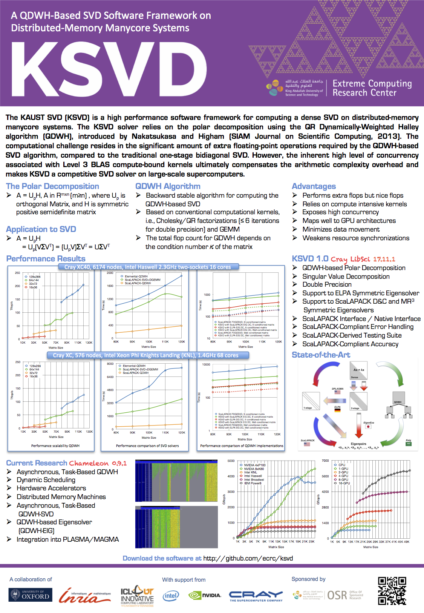

KSVD
================
**The KAUST SVD (KSVD) is a high performance software framework for computing a dense SVD on distributed-memory manycore systems.** 
The KSVD solver relies on the polar decomposition using the QR Dynamically-Weighted Halley algorithm (QDWH), 
introduced by Nakatsukasa and Higham (SIAM Journal on Scientific Computing, 2013). 
The computational challenge resides in the significant amount of extra floating-point operations required by the QDWH-based SVD algorithm,
compared to the traditional one-stage bidiagonal SVD. 
However, the inherent high level of concurrency associated with Level 3 BLAS compute-bound kernels ultimately 
compensates the arithmetic complexity overhead and makes KSVD a competitive SVD solver on large-scale supercomputers.

Current Features of KSVD
===========================

- Support double precision
- Support dense two-dimensional block cyclic data distribution
- Support Support to ELPA Symmetric Eigensolver
- Support Support to ScaLAPACK D&C and MR3 Symmetric Eigensolvers
- ScaLAPACK Interface / Native Interface
- ScaLAPACK-Compliant Error Handling
- ScaLAPACK-Derived Testing Suite
- ScaLAPACK-Compliant Accuracy
 
Programming models (backends) and dependencies:
1.  MPI
2.  ScaLAPACK
3.  QDWH (https://github.com/ecrc/qdwh)


Installation
============

Installation requires at least **CMake** of version 3.2.3. To build KSVD,
follow these instructions:

1.  Get KSVD from git repository

        git clone git@github.com:ecrc/ksvd

2.  Go into KSVD folder

        cd ksvd

3.  Create build directory and go there

        mkdir build && cd build

4.  Use CMake to get all the dependencies

        cmake .. -DCMAKE_INSTALL_PREFIX=/path/to/install/

5.  To build the testing binaries (optional)

        cmake .. -DCMAKE_INSTALL_PREFIX=/path/to/install/ -DKSVD_TESTING:BOOL=ON -DQDWH_DIR=/path/to/qdwh/installation

5.  Build KSVD

        make -j

6.  Install KSVD

        make install

7. Add line

        export PKG_CONFIG_PATH=/path/to/install/lib/pkgconfig:$PKG_CONFIG_PATH

    to your .bashrc file.

Now you can use pkg-config executable to collect compiler and linker flags for
KSVD.

Testing and Timing
==================

The directories testing and timing contain an example 
to test the accuracy and the performance of KSVD using
ill/well-conditioned random matrices.

   The complete list of options is available below with -h option:
  
  ```
     "======= KSVD testing using ScaLAPACK\n"
     " -p      --nprow         : Number of MPI process rows\n"
     " -q      --npcol         : Number of MPI process cols\n"
     " -jl     --lvec          : Compute left singular vectors\n"
     " -jr     --rvec          : Compute right singular vectors\n"
     " -n      --N             : Dimension of the matrix\n"
     " -b      --nb            : Block size\n"
     " -m      --mode          : [1:6] Mode from pdlatms used to generate the matrix\n"
     " -k      --cond          : Condition number used to generate the matrix\n"
     " -o      --optcond       : Estimate Condition number using QR\n"
     " -i      --niter         : Number of iterations\n"
     " -r      --n_range       : Range for matrix sizes Start:Stop:Step\n"
     " -polarqdwh --polarqdwh  : Find polar decomposition using QDWH A=UH \n"
     " -polarsvd  --polarsvd   : Find the polar decomposition using scalapack-svd \n"
     " -s      --slsvd         : Run reference ScaLAPACK SVD\n"
     " -w      --qwmr          : Run KSVD with ScaLAPACK MRRR EIG\n"
     " -e      --qwdc          : Run KSVD with ScaLAPACK DC EIG\n"
     " -l      --qwel          : Run KSVD with ScaLAPACK DC EIG\n"
     " -c      --check         : Check the solution\n"
     " -fqwsvd --profqwsvd     : Enable profiling ksvd\n"
     " -fqw    --profqw        : Enable profiling QDWH\n"
     " -v      --verbose       : Verbose\n"
     " -h      --help          : Print this help\n" );
```
     On Cray systems, the launching command typically looks like:
    
       srun --ntasks=nT --hint=nomultithread ./main --nprow p --npcol q --b 64 --cond 1e16 --niter 1 --n_range start:stop:step --check --qwmr --qwdc --qwel --slsvd

     1. The number of the nodes is N, the number of tasks (nT) = N * (number_of_cores per node ). The programming model is pure MPI (no OpenMP, i.e., sequential BLAS).
     2. PxQ is the process grid configuration, where (nT - PxQ = 0)
     3. To compute the SVD decomposition using KSVD, the polar decomposition is calculated first, then followed by MRRR (--qwmr) or 
	 DC (--qwdc) or ELPA-DC (--qwel), as various alternatives for the symmetric eigensolvers.
     4. To use the regular bidiagonal reduction SVD from ScaLAPACK PDGESVD: --slsvd


TODO List
=========

1.  Add support for the other precisions 
2.  Provide full StarPU support (GPUs and distributed-memory systems)
3.  Port to other dynamic runtime systems (e.g., PaRSEC)


References
==========
1. D. Sukkari, H. Ltaief, M. Faverge, and D. Keyes, Asynchronous Task-Based Polar
Decomposition on Massively Parallel Systems, *IEEE Transactions on Parallel and 
Distributed Systems*, 2017.
2. D. Sukkari, H. Ltaief and D. Keyes, A High Performance QDWH-SVD Solver using
Hardware Accelerators, *ACM Transactions on Mathematical Software*, vol. 43 (1), pp. 1-25, 2016.
3. D. Sukkari, H. Ltaief and D. Keyes, High Performance Polar Decomposition for SVD
Solvers on Distributed Memory Systems, Best Papers, Proceedings of the 22nd International Euro-Par Conference, 2016.


Questions?
==========
Please feel free to create an issue on Github for any questions and inquiries.




